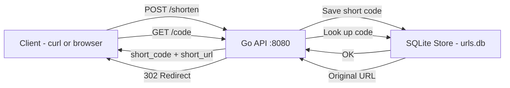
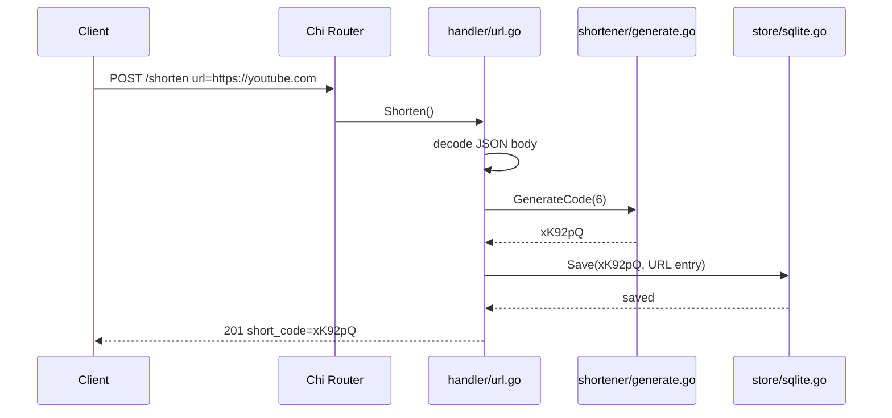
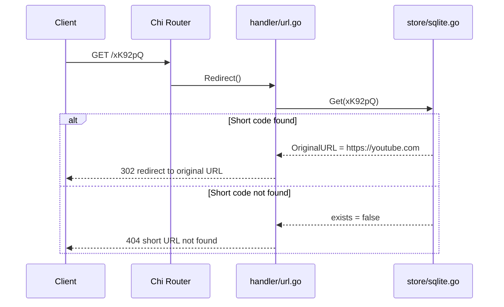
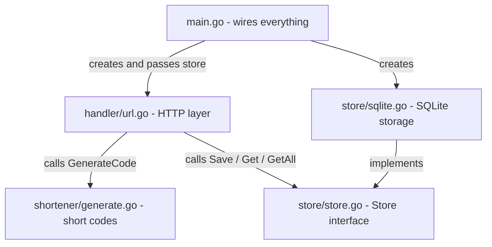
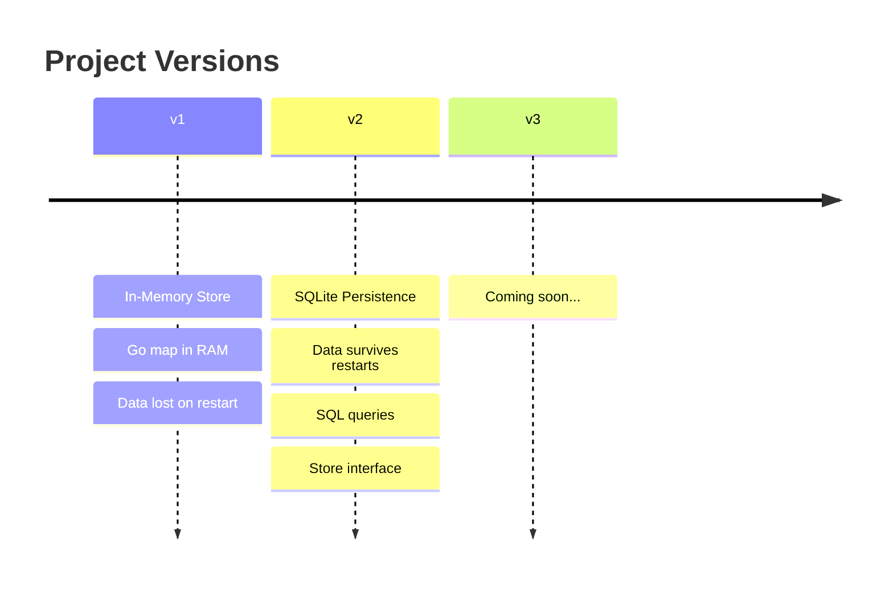

# 🔗 URL Shortener

A URL shortening API built with Go — built from scratch as a learning project.

This project grows one version at a time. Each version introduces new concepts and replaces the previous implementation.

---

## Current Version — v2 (SQLite Persistence)

> URLs are stored in a SQLite database file (`urls.db`). Data survives server restarts.

---

## How It Works



---

## API Endpoints

| Method | Endpoint | Description |
|--------|----------|-------------|
| `POST` | `/shorten` | Shorten a long URL |
| `GET` | `/{code}` | Redirect to the original URL |
| `GET` | `/urls` | List all stored URLs |

---

## Request Flow — POST /shorten



---

## Request Flow — GET /{code}



---

## Project Structure

```
url-shortener/
├── main.go                   → entry point, router setup, wires everything
├── handler/
│   └── url.go                → HTTP handlers (Shorten, Redirect, ListURLs)
├── shortener/
│   └── generate.go           → generates random Base62 short codes
├── store/
│   ├── store.go              → Store interface (contract for any storage backend)
│   └── sqlite.go             → SQLite implementation (Save, Get, GetAll)
├── docs/
│   └── versions/
│       ├── version-01-memory.md       → v1 documentation
│       └── version-02-persistence.md  → v2 plan (SQLite)
├── urls.db                   → SQLite database file (created automatically)
├── go.mod
└── go.sum
```

---

## How the Code Connects



---

## Getting Started

### Prerequisites

- [Go 1.21+](https://go.dev/dl/)

### Run the server

```bash
go run main.go
```

The server starts on `http://localhost:8080`. A `urls.db` file is created automatically in the project folder on first run.

### Test the endpoints

**Shorten a URL:**
```powershell
Invoke-RestMethod -Uri http://localhost:8080/shorten -Method POST -ContentType "application/json" -Body '{"url": "https://www.youtube.com"}'
```

**List all URLs:**
```powershell
Invoke-RestMethod -Uri http://localhost:8080/urls -Method GET
```

**Redirect (replace `xK92pQ` with your short code):**
```powershell
Invoke-RestMethod -Uri http://localhost:8080/xK92pQ -Method GET
```

Or just open `http://localhost:8080/xK92pQ` in your browser — it will redirect automatically.

---

## Versions



| Version | Storage | Status |
|---------|---------|--------|
| v1 | In-memory (Go map) | ✅ Complete |
| v2 | SQLite (on disk) | ✅ Complete |
| v3 | TBD | 📋 Planned |

---

## Known Limitations (v2)

- No duplicate short code checking
- No link expiry
- No click tracking / analytics
- No custom short codes

---

## Tech Stack

| Tool | Purpose |
|------|---------|
| [Go](https://go.dev) | Language |
| [Chi](https://github.com/go-chi/chi) | HTTP router |
| [modernc.org/sqlite](https://pkg.go.dev/modernc.org/sqlite) | SQLite driver (pure Go, no CGo) |
| `database/sql` | Go standard library database interface |

---

*This project is a learning exercise — built step by step, one version at a time.*
