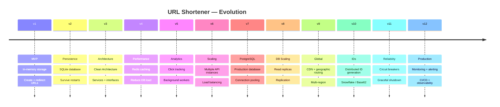

# URL Shortener

> **Project Goal**
>
> Build a production-inspired URL Shortener that evolves from a simple single-process application into a scalable distributed system.
>
> Every architectural decision must solve a real problem. No technology is introduced unless the current solution has become insufficient.

---

# Guiding Principles

* Start simple.
* Add complexity only when necessary.
* Understand every engineering decision.
* Optimize only after identifying a bottleneck.
* Prefer reasoning over memorization.
* Every version should be deployable.
* Every new component should solve a real business or technical problem.

---

# Product Requirements

Users should be able to:

* Create short URLs
* Visit short URLs and be redirected
* Store URLs permanently
* View basic analytics
* Manage URLs (future)
* Create custom aliases (future)
* Expire links (future)

---

# Learning Goals

By the end of this project, I should understand:

* HTTP and REST APIs
* Go fundamentals
* Clean Architecture
* Dependency Injection
* Database design
* SQL
* Concurrency
* Caching
* Background workers
* Distributed systems
* System Design
* Scalability
* Reliability
* Observability
* Production-ready backend engineering

---

# Roadmap

---

## Version 1 — Minimum Viable Product ✅

**Goal:** Build the smallest working URL shortener.

### Features
* Create short URL
* Redirect to original URL
* In-memory storage
* Random short-code generation
* Basic validation

### Concepts
* HTTP, Routing, Handlers
* Structs, Maps
* Dependency Injection
* Request lifecycle

### Questions
* How does an HTTP request flow through the application?
* What data do we actually need?
* How should responsibilities be separated?

---

## Version 2 — Persistent Storage 🔄

**Problem:** Data disappears whenever the server restarts.

### Features
* SQLite storage
* Database initialization
* Migrations
* CRUD operations

### Concepts
* SQL
* Repositories
* Transactions
* Connection management

### Questions
* Why is memory insufficient?
* What are the trade-offs of SQLite?

---

## Version 3 — Better Architecture 📋

**Problem:** The application is becoming harder to maintain.

### Goals
* Separate business logic
* Improve testability
* Reduce coupling

### Concepts
* Clean Architecture
* Services
* Dependency Inversion
* Interfaces
* Unit testing

---

## Version 4 — Performance 📋

**Problem:** The database is receiving too many read requests.

### Goals
* Reduce database load
* Improve response times

### Concepts
* Caching
* Cache Aside Pattern
* TTL
* Cache invalidation

---

## Version 5 — Analytics 📋

**Problem:** Recording every click slows down requests.

### Goals
* Record analytics
* Keep redirects fast

### Concepts
* Background workers
* Queues
* Event-driven architecture
* Asynchronous processing

---

## Version 6 — Horizontal Scaling 📋

**Problem:** One API server can no longer handle traffic.

### Goals
* Run multiple API instances
* Distribute requests

### Concepts
* Stateless services
* Load balancing
* Health checks

---

## Version 7 — Production Database 📋

**Problem:** SQLite is no longer sufficient.

### Goals
* Migrate to PostgreSQL
* Improve database performance

### Concepts
* Connection pooling
* Indexing
* Query optimization
* Isolation levels

---

## Version 8 — Database Scaling 📋

**Problem:** The database is becoming a bottleneck.

### Goals
* Scale reads
* Improve availability

### Concepts
* Replication
* Read replicas
* Eventual consistency
* Failover

---

## Version 9 — Global Scale 📋

**Problem:** Users are connecting from multiple regions.

### Goals
* Reduce latency
* Improve user experience

### Concepts
* Geographic routing
* CDNs
* DNS
* Regional deployments

---

## Version 10 — Distributed ID Generation 📋

**Problem:** Multiple servers must generate unique short codes.

### Goals
* Prevent collisions
* Maintain uniqueness

### Concepts
* Base62 encoding
* UUIDs
* Snowflake IDs
* Distributed ID generation

---

## Version 11 — Reliability 📋

**Problem:** Real systems fail.

### Goals
* Handle failures gracefully
* Improve resilience

### Concepts
* Retries
* Timeouts
* Circuit breakers
* Graceful shutdown
* Health endpoints

---

## Version 12 — Production Readiness 📋

**Goal:** Operate the application like a real production service.

### Concepts
* Monitoring
* Metrics
* Logging
* Tracing
* Backups
* Alerting
* Deployment
* CI/CD

---

# Engineering Mindset

For every new feature or technology, answer:

1. What problem are we solving?
2. Why is the current solution no longer enough?
3. What alternatives exist?
4. What trade-offs are we accepting?
5. What would happen if we did nothing?
6. How does this affect scalability, reliability, performance, and cost?

> No technology should be added simply because it is popular.
> Every decision must be justified.
