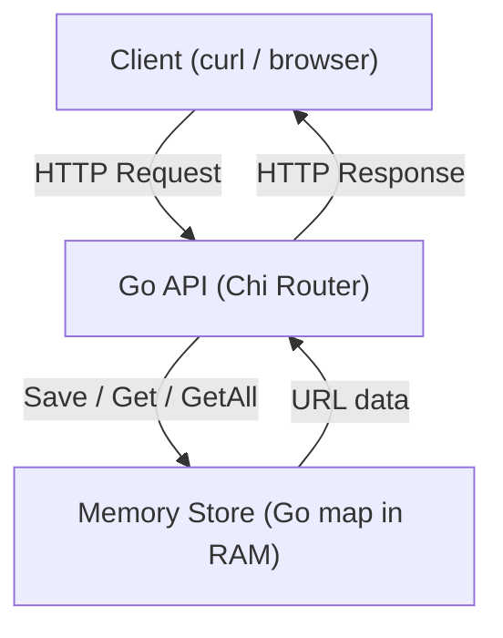
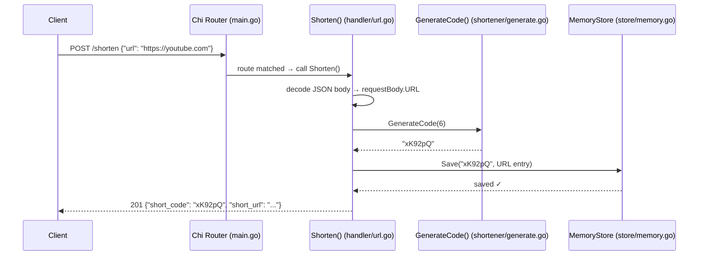
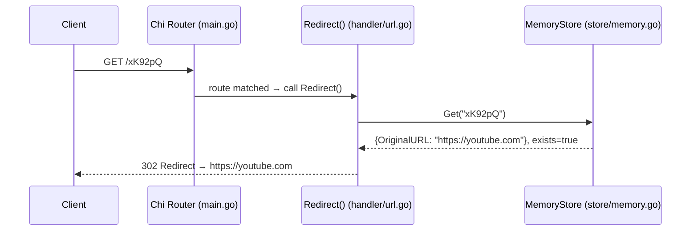
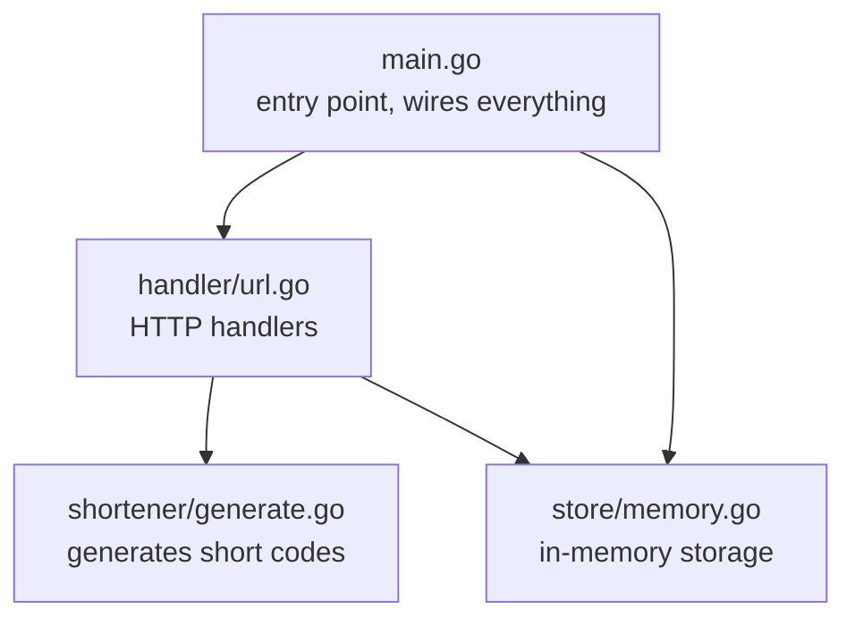
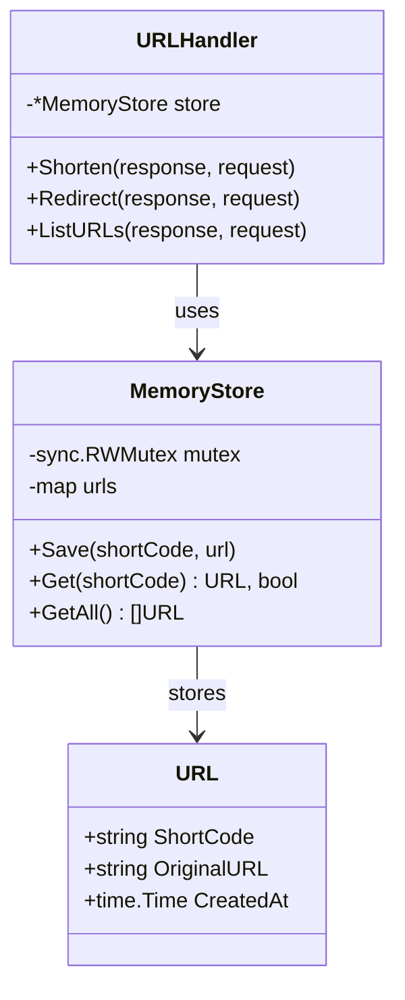

# Version 1 — In-Memory URL Shortener

## What We Built

A simple HTTP API that shortens long URLs into short codes.

The application runs entirely in memory.

No database. No file storage. No external dependencies beyond the router.

---

## Architecture

---

## Request Flow — POST /shorten

---

## Request Flow — GET /{code}

---

## How It Works

1. A client sends a long URL to `POST /shorten`
2. The API generates a random 6-character short code
3. The short code and original URL are saved in a Go map
4. The client receives the short code back
5. When someone visits `GET /{code}`, the API looks up the code and redirects them

---

## Project Structure

---

## Endpoints

| Method | Path       | Description                        |
|--------|------------|------------------------------------|
| POST   | /shorten   | Accept a URL, return a short code  |
| GET    | /{code}    | Redirect to the original URL       |
| GET    | /urls      | List all stored URLs               |

---

## Key Files Explained

### `store/memory.go`
Holds all URL data in a `map[string]URL`.

The key is the short code. The value is a `URL` struct containing the short code, original URL, and creation time.

Uses `sync.RWMutex` to prevent data corruption when multiple requests arrive at the same time.

### `handler/url.go`
Reads HTTP requests, calls the store, and writes JSON responses.

All three handler functions (`Shorten`, `Redirect`, `ListURLs`) share access to the store through the `URLHandler` struct.

### `shortener/generate.go`
Generates a random string of a given length using Base62 characters (a–z, A–Z, 0–9).

62^6 = ~56 billion possible codes.

### `main.go`
Creates the store, creates the handler (passing the store in), registers routes, and starts the server on port 8080.

---

## Data Model

---

## What We Learned

* Go project structure (packages, files)
* Structs as blueprints and constructors (`NewXxx` pattern)
* Pointers and why `&` matters
* Method receivers — how functions attach to structs
* HTTP handlers — `response` and `request`
* JSON encoding and decoding
* Maps and slices
* `sync.RWMutex` for concurrent safety
* `defer` for automatic cleanup
* Dependency injection — passing the store into the handler instead of using globals
* How Go compares to Express (Node.js)

---

## Known Limitations

* **Data is not persistent** — all URLs are lost when the server restarts
* **No duplicate checking** — two URLs can receive the same short code if you're unlucky
* **No expiry** — short links live forever (until the server restarts)
* **No click tracking** — no analytics on how many times a link was visited
* **No custom codes** — users cannot choose their own short code

---

## What Comes Next

Version 2 replaces the in-memory store with a SQLite database so that data survives server restarts.
