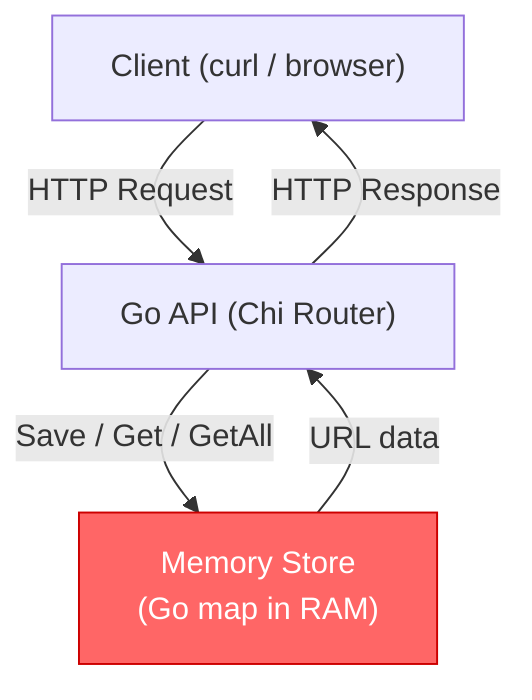
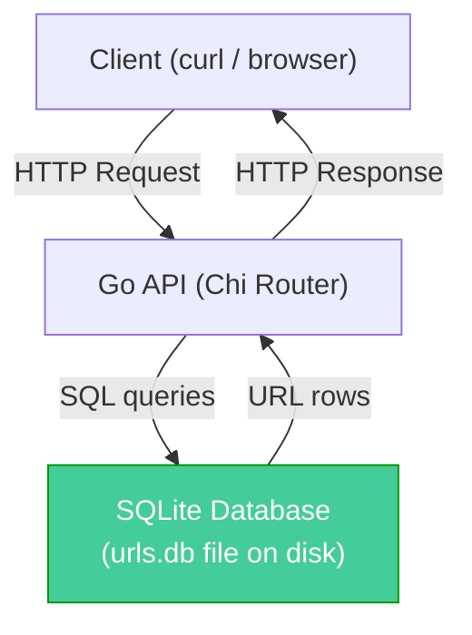
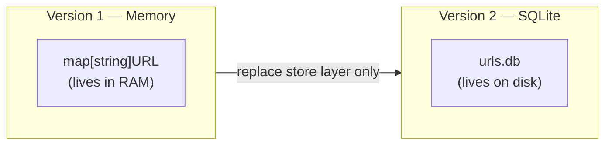
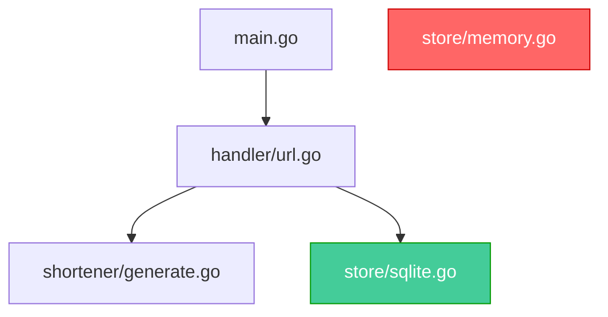
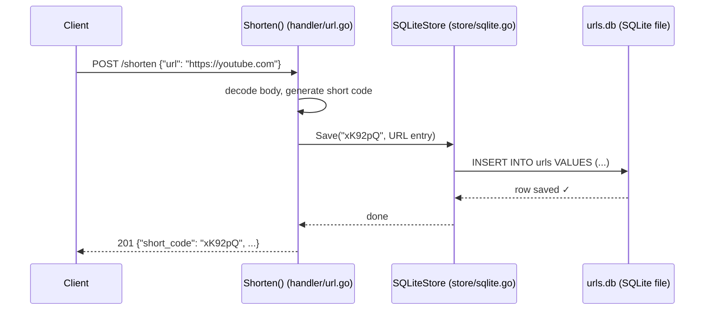
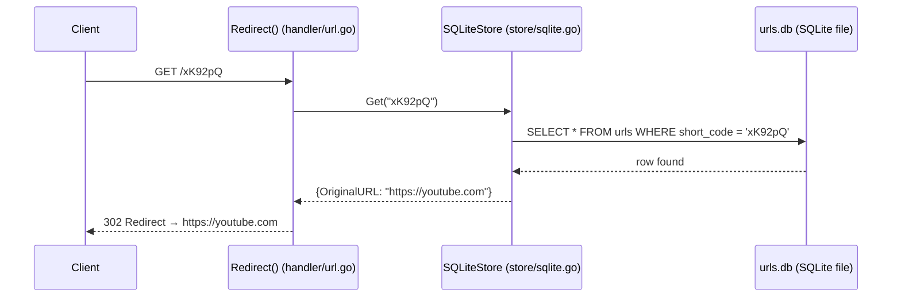

# Version 2 — Persistence

## Problem

The current application stores all URLs in memory.

When the server stops or restarts, every shortened URL is lost.

This makes the application unreliable because users expect their links to remain available over time.

---

## Goal

Replace the in-memory storage with persistent storage so that URLs survive server restarts.

---

## Current Architecture (Version 1)

> ⚠️ RAM is wiped when the server stops. All data is lost.

---

## Target Architecture (Version 2)

> ✅ SQLite writes to a file on disk. Data survives restarts.

---

## Before vs After

The handler and router stay exactly the same.
Only the store layer is swapped.

---

## Why are we making this change?

Memory is temporary.

A database persists data even after the application stops running.

---

## Questions to Answer

* What is a database?
* Why SQLite?
* Why not PostgreSQL yet?
* What information do we need to store?
* How should our application communicate with SQLite?
* Can we replace our storage without changing the rest of the application?

---

## What Changes vs What Stays the Same

| File | Status |
|------|--------|
| `main.go` | ✅ No change |
| `handler/url.go` | ✅ No change |
| `shortener/generate.go` | ✅ No change |
| `store/memory.go` | 🔴 Replaced |
| `store/sqlite.go` | 🟢 New file |

---

## New Data Flow — POST /shorten

---

## New Data Flow — GET /{code}

---

## Expected Learning

* Persistent storage
* SQL
* SQLite
* CRUD operations
* Database connections
* Repository pattern
* Dependency inversion
